# LAB1 : Introduction à la sécurité des containers

---

# 1 : Lancer un container simple

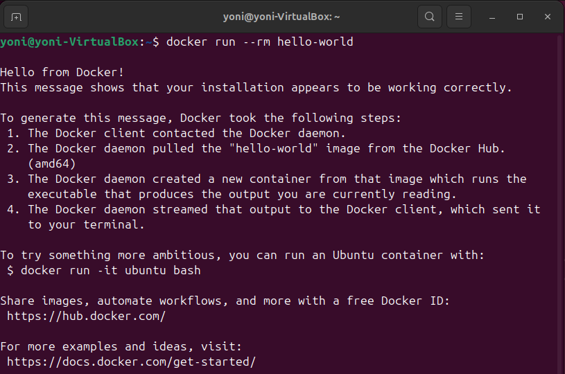

J'utilise ici la commande `docker run --rm hello-world` pour vérifier que Docker fonctionne correctement.

---

#  2 : Analyser les ressources système

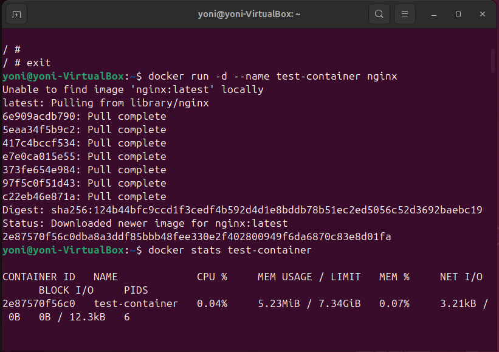

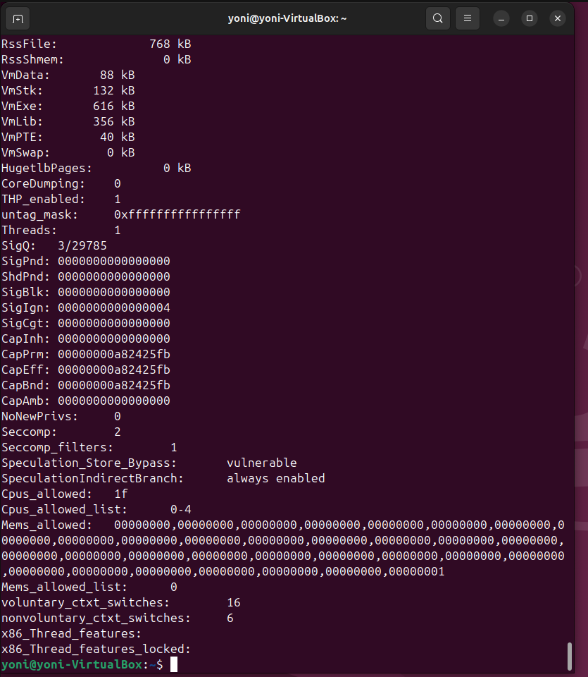

Le container Nginx est lancé en arrière-plan (`-d`) avec le nom `test-container`. La commande `docker stats test-container` permet de monitorer la consommation de CPU et de mémoire du container en temps réel.

---

# 3 : Lister les capacités du container

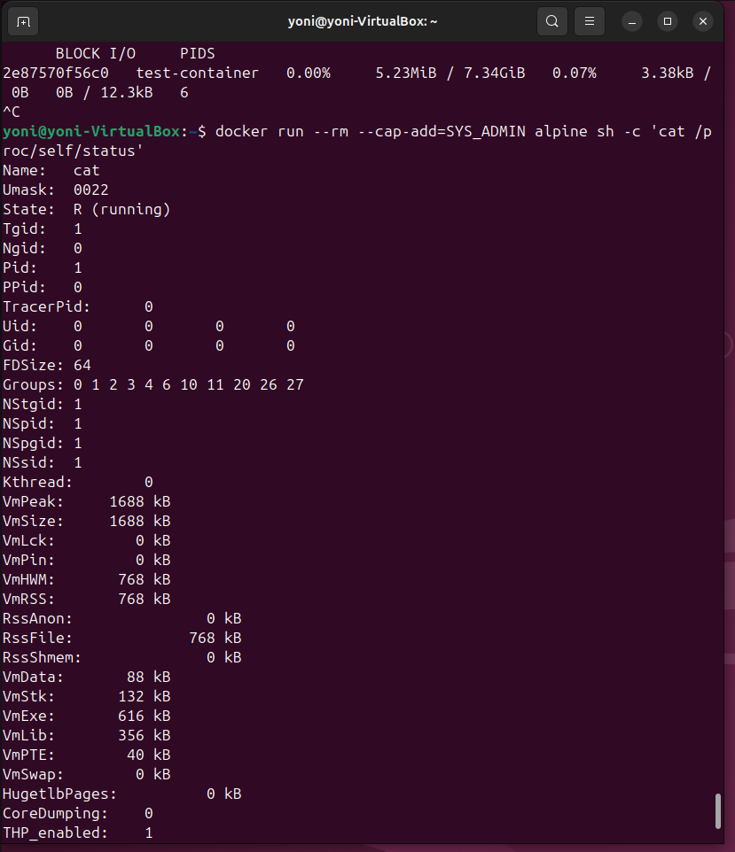

Je vérifie ici les permissions accordées à un container. La commande `--cap-add=SYS_ADMIN` donne des capacités étendues au container, ce qui peut poser un risque de sécurité.

---

# 4 : Tester un container avec des permissions élevées

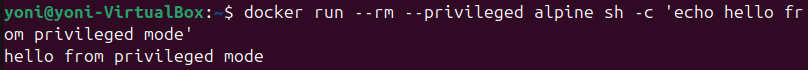

La commande `--privileged` donne au container un accès complet au système hôte. Cela démontre combien une mauvaise configuration peut permettre l’exécution de commandes potentiellement critiques.

---

# 5 : Simuler une évasion de container

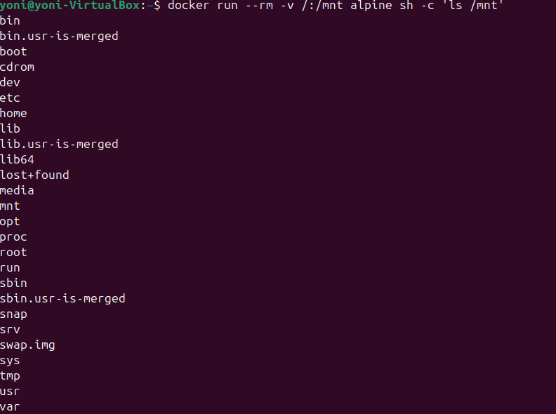

En montant un volume `-v /:/mnt` dans un container, l'utilisateur accède potentiellement aux fichiers de l’hôte, ce qui est une faille majeure si mal contrôlée.

---

# 8 : Créer une image sécurisée

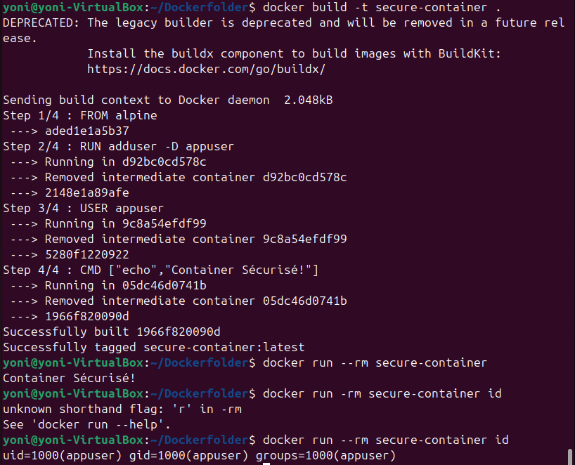

Je crée un `Dockerfile` minimaliste avec un utilisateur non privilégié. Cela réduit fortement les risques d’élévation de privilèges.

---

# 9 : Restreindre l’accès réseau

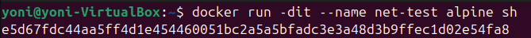

La commande `docker network disconnect` empêche le container d’accéder à Internet. Cela permet d'isoler certains composants sensibles ou vulnérables.

---

# 10 : Scanner une image vulnérable avec Trivy

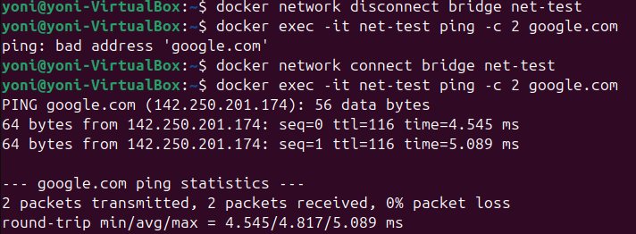

À l'aide de Trivy, une image vulnérable est scannée. Le rapport met en évidence plusieurs CVEs critiques, soulignant l’importance de ne pas utiliser des images issues de sources non vérifiées.

---

# 11 : Résumé des vulnérabilités

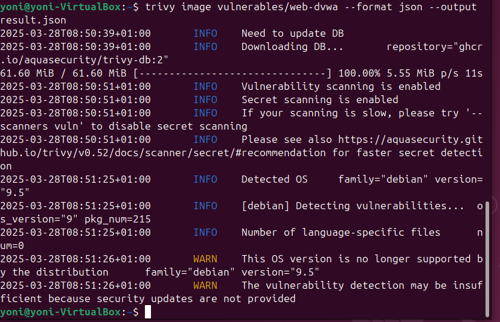

Les vulnérabilités trouvées sur l’image concernent des composants critiques. Certaines CVE sont classées HIGH voire CRITICAL, ce qui justifie le besoin de remédiation immédiate.

---

# 12 : Scanner avec Grype

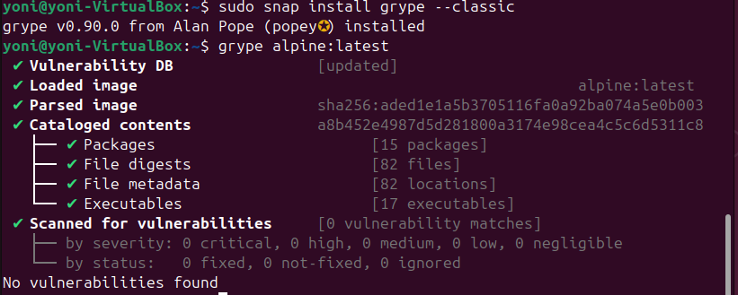

Grype complète Trivy avec une base différente. L’analyse montre aussi des vulnérabilités, avec un niveau de détail différent.

---

# 13 : Comparaison Grype vs Trivy

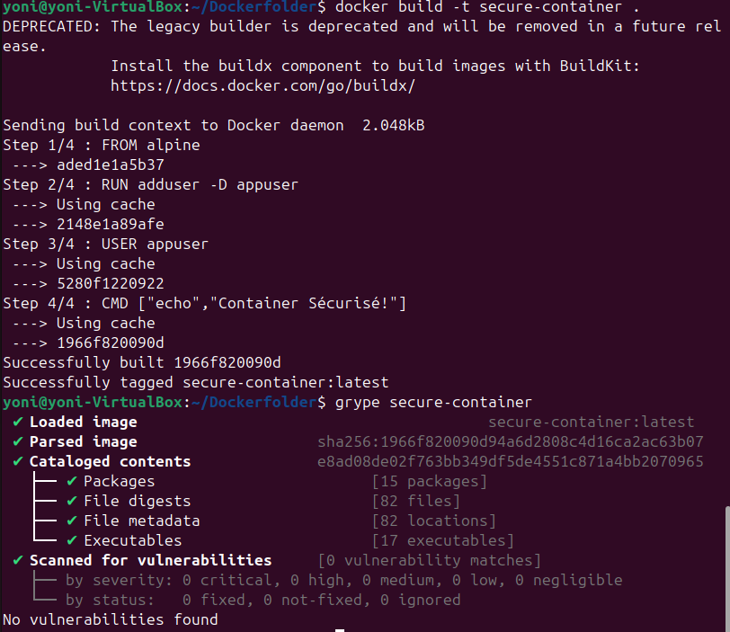

Grype et Trivy peuvent trouver des vulnérabilités différentes selon leur base de données et méthode de scan.

---

# Étude de Cas : Attaque par Élévation de Privilège

Plusieurs mesures auraient pu empêcher cette attaque :

- Exécuter les containers avec des utilisateurs non privilégiés : éviter l’usage du compte root à l’intérieur du container.
- Utiliser des profils AppArmor ou SELinux : pour restreindre les permissions système des containers.
- Éviter les options comme `--privileged` ou `--cap-add=SYS_ADMIN` : elles donnent trop de droits au container.
- Limiter les montages de volumes sensibles : ne jamais monter `/` ou d'autres répertoires critiques de l’hôte dans un container.
- Appliquer des politiques de sécurité comme les PodSecurityStandards (PSS) en environnement Kubernetes.
- Scanner régulièrement les images pour identifier des vulnérabilités connues.
- Mettre en place des audits réguliers et des outils de détection d’anomalies comme Falco pour surveiller les comportements suspects.
