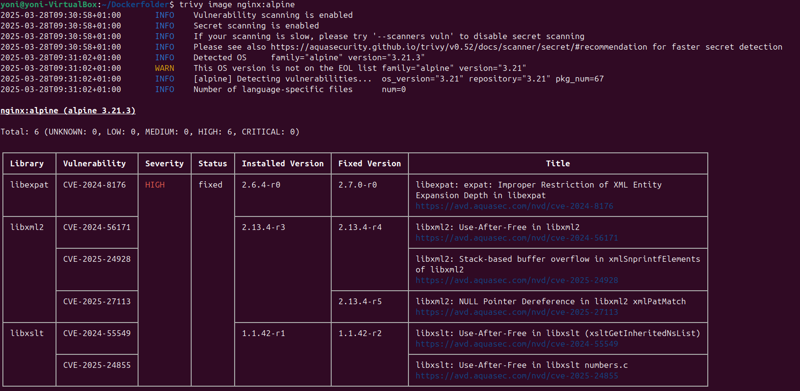
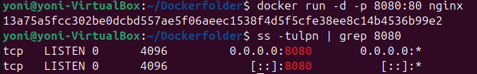
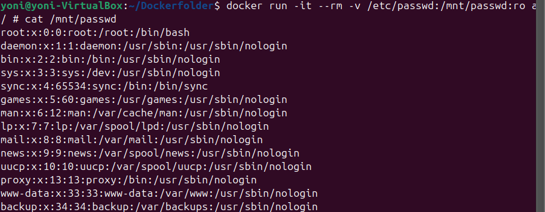
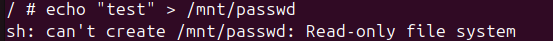
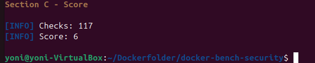
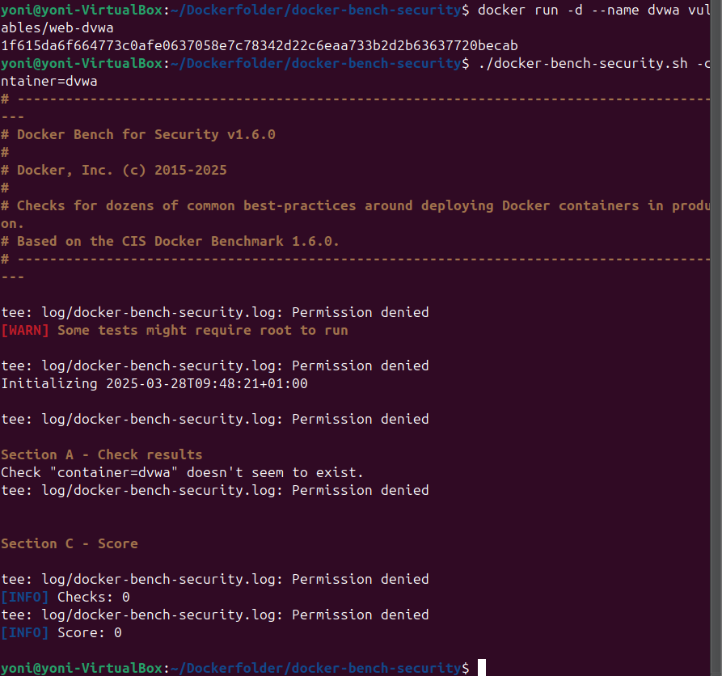
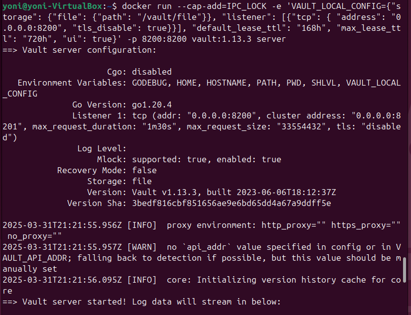
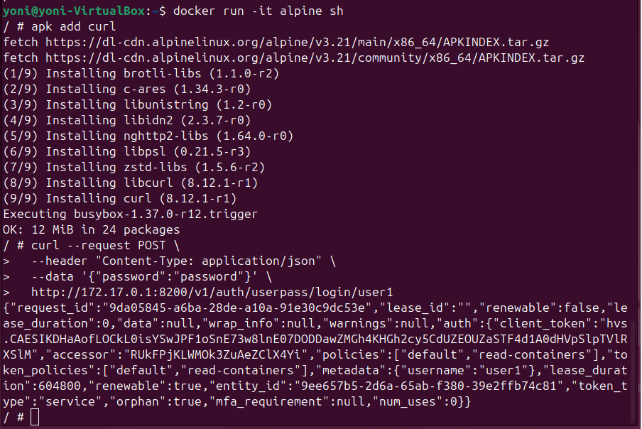
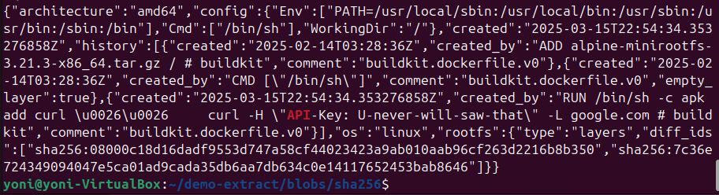

# LAB2 : Bonnes pratiques pour sécuriser les containers

---

### 1 : Exploration des blobs de l’image Docker

On peut voir la clé API est visible dans l’historique de build de l’image.

---

### 2 :  Scan de vulnérabilités

---

### 3 : Utilisation de curl dans un conteneur Alpine

Installation de curl dans un conteneur Alpine, accès à Vault simulé.

---

### 4 : Lancement du conteneur Vault

---

### 5 : Audit Docker

---

### 6 : Audit partiel avec Docker Bench Security

On peut voir les erreurs liées aux permissions et limitations.

---

### 7 : Résultat complet de l’audit Docker Bench

---

### 8 : Lecture d’un fichier système depuis un conteneur

Accès réussi1.

---

### 9 : Présence d’une clé API

---

## Réponses

### Pouvez-vous lire le fichier `/mnt/passwd` ?
Oui, la lecture est possible grâce au montage en lecture seule comme le montre la commande `cat /mnt/passwd`.

### Pouvez-vous écrire dans le fichier `/mnt/passwd` ?
Non, l’écriture échoue car le système de fichiers est monté en lecture seule.

### Auditer votre host, quel est votre score ?
Le score est de 6 sur 117 vérifications (image 6). Cela indique un faible niveau de conformité de l’hôte aux bonnes pratiques de sécurité Docker.

### Auditer le container `vulnerables/web-dvwa`, que remarquez-vous ?
Le container n’a pas pu être audité correctement. Le benchmark indique que le container `dvwa` n’existe pas, et la majorité des tests ont échoué, avec des erreurs de permissions.

### Comment le développeur aurait dû faire pour éviter ceci ? (cf. capture clé API)
Le développeur aurait dû :
- Ne pas inclure de clé API sensible dans l’image Docker.
- Utiliser des variables d’environnement ou des secrets injectés au runtime.
- Utiliser une solution de scan automatisé comme Trivy pour détecter la présence d’informations sensibles dans l’image.

### Lancer un container docker nginx et accéder au container dans votre navigateur sur le port 80. Est-ce que ça fonctionne ?
Non, cela ne fonctionne pas dans l’état présenté. Le port 80 est déjà utilisé par un autre service ou bloqué.

### Si cela ne fonctionne pas, comment remédier au problème ?
Il faut soit :
- Utiliser un autre port hôte.
- Libérer le port 80 si il est déjà utilisé.
- Vérifier les règles de pare-feu ou de SELinux/AppArmor qui bloquent l’accès.

### Lancer un `security-bench` docker comme le .3. Remarquez-vous des différences par rapport au premier `security-bench` ?
Oui, il y a une différence : le second audit donne un score plus faible et plus d’erreurs, cela peut être causé par des permissions limitées ou de l’environnement restreint dans lequel le benchmark est lancé.
