# LAB3 : Sécurité des orchestrateurs Kubernetes

---

# 1 : Initialisation du cluster et contrôles d'accès (RBAC)

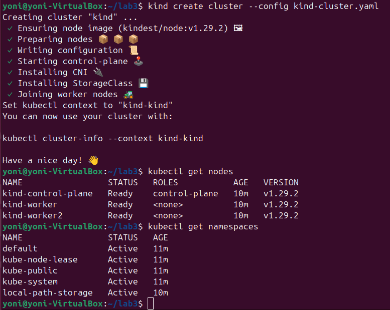

Mise en place du cluster Kubernetes et application des premières règles RBAC pour contrôler les accès aux ressources.

---

# 2 : Création d'un rôle et binding

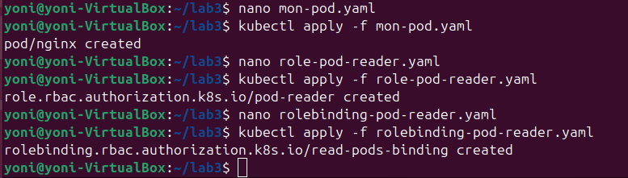

Création d'un Role spécifique donnant des droits restreints et liaison à un utilisateur ou service account via RoleBinding.

---

# 3 : Test d’accès sans permissions suffisantes

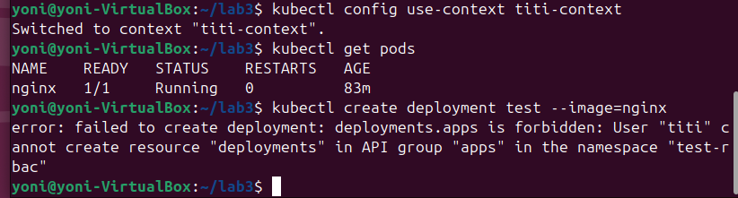

Tentative d'accès interdit vérifiant l'efficacité de la politique RBAC appliquée.

---

# 4 :  Audit de la configuration Kubernetes

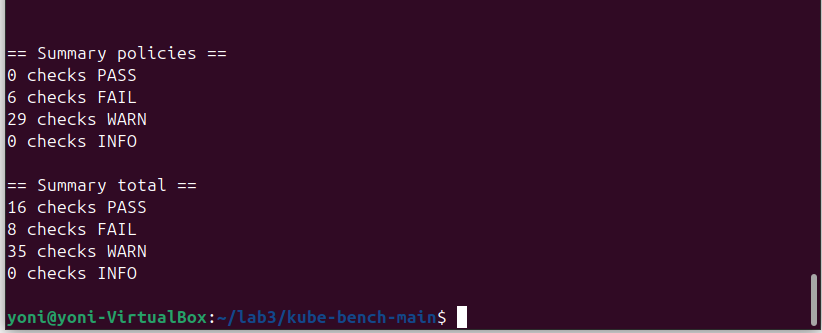

Configuration du module d'audit pour Kubernetes.

---

# 5 : Démarrage des composants de sécurité

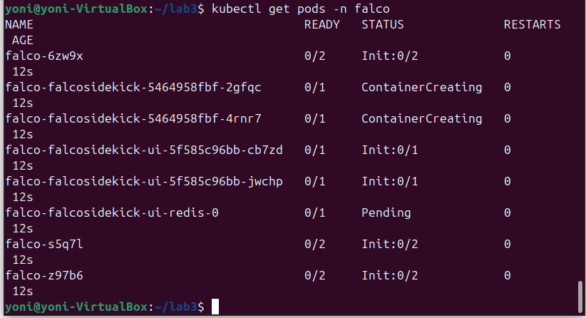

---

# 6 : Déploiement de Falco pour la surveillance comportementale

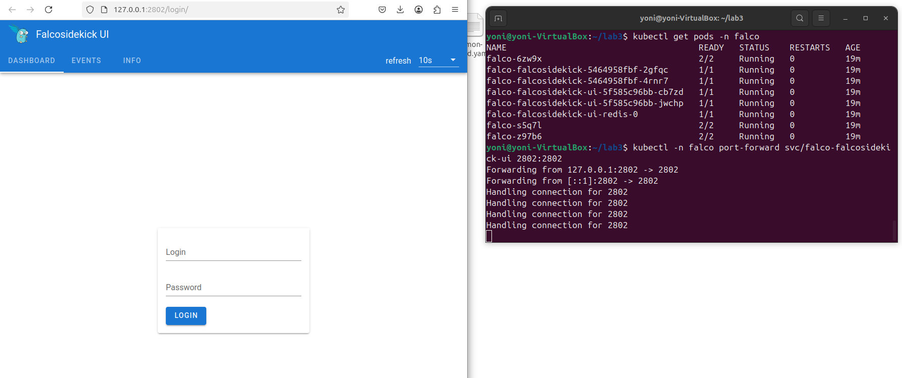

Installation de Falco pour surveiller les comportements suspects.

---

# 7 : Simulation d'activité anormale

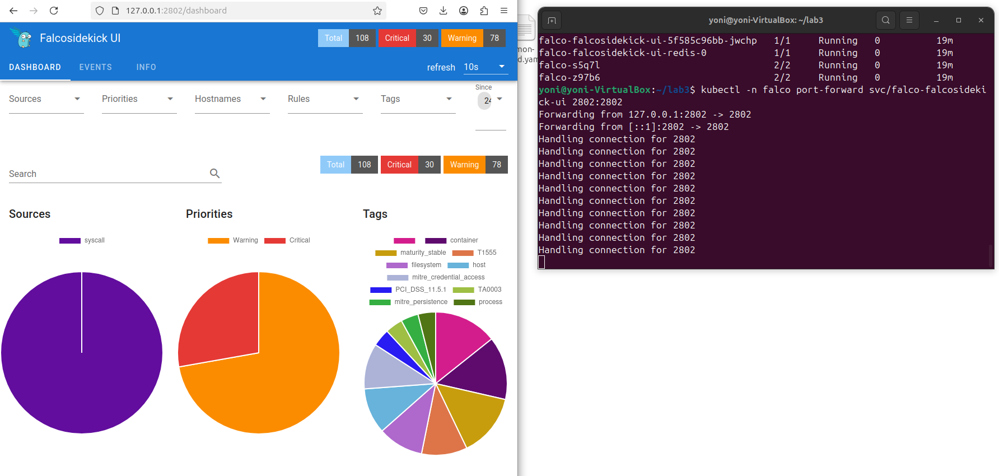

Simulation d'une attaque avec ouverture d'un shell dans un pod et détection immédiate par Falco.

---

# 8 : Analyse de l'alerte Falco

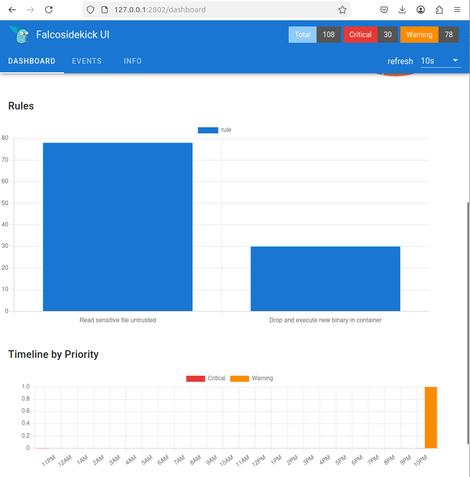

Lecture d'une alerte Falco décrivant l'activité suspecte détectée.

---

# 9 : Affinage des règles Falco

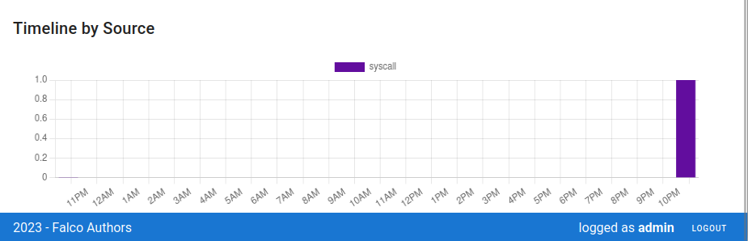

---

# 10 : Tests finaux de journaux d'audit et détection

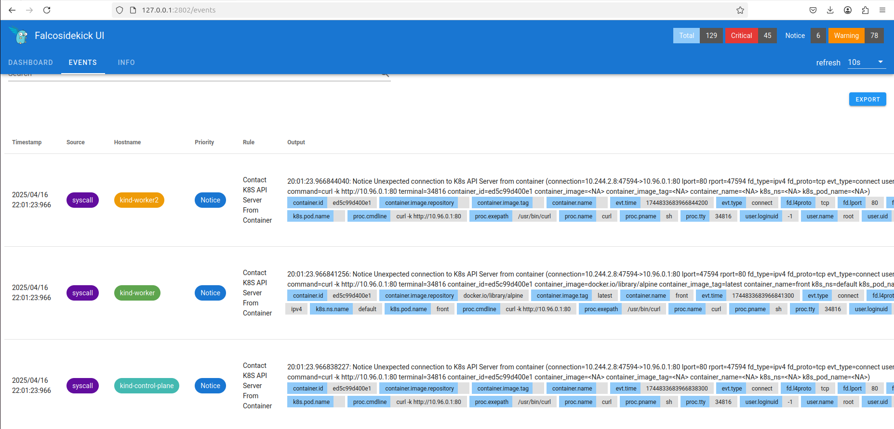

Validation de la présence des événements simulés à la fois dans les journaux d'audit et les alertes Falco.

---

# 11 : Bilan et bonnes pratiques de durcissement

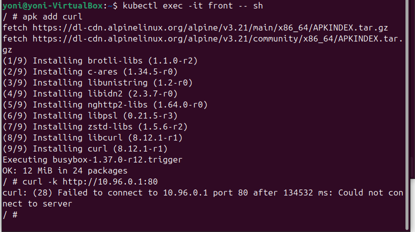

Récapitulatif des bonnes pratiques appliquées : RBAC strict, audit logging activé, surveillance comportementale dynamique.

---

# Réponses

### Comment afficher la liste des namespaces ?

Il faut utiliser la commande suivante :
```bash
kubectl get namespaces
```

### Quelle version de Kubernetes vous avez déployée ?

Les version client 1.28.2 et server 1.28.2 ont été deployées.

### Comment afficher les logs de ce pod ?

Il faut utiliser la commande suivante : 
```bash
kubectl logs <nom-du-pod> -n <namespace>
```

### Comment afficher ce rôle ?

Il faut utiliser la commande suivante : 
```bash
kubectl get role <nom-du-role> -n <namespace> -o yaml
```

### Tester de lister les pods dans le namespace test-rbac, pouvez-vous le faire ?

Non car les droits RBAC sont restreints.

### Pouvez-vous créer un pod dans le namespace test-rbac ? Si non, quel est le message d'erreur ?

Non, j'obtient le message d'erreur suivant :
```
Error from server (Forbidden): pods is forbidden: User "dev-user" cannot create resource "pods" in API group "" in the namespace "test-rbac"
```

### Est-ce que vous avez une alerte concernant cette action ? Si oui, quelle est sa priorité ? Et la règle ?

Oui, j'obtient :
```
Priority: Warning
Rule: Terminal shell in container
```
Falco détecte l'ouverture d'un shell dans un pod, et le considère comme un comportement suspect.
