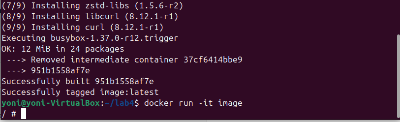
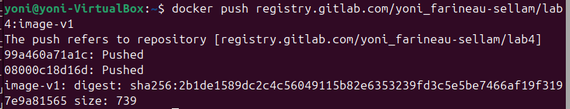
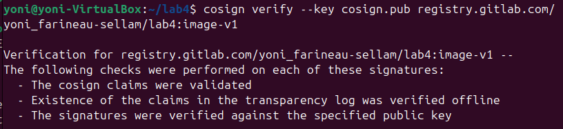
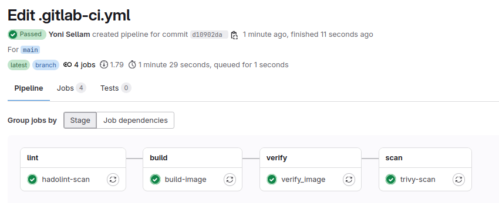
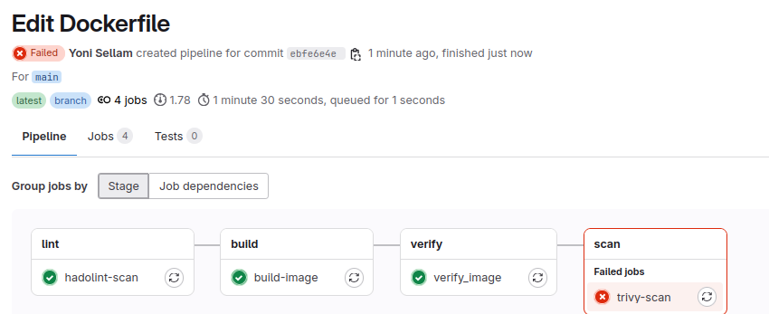

# LAB4 : Outils CI/CD

---

## 1 : Générer une paire de clés

Génération d'une paire de clés pour signer les images Docker.
---

## 2 : Signer une image Docker et la pousser sur GitLab

---

## 3 :  Vérification de la signature réussie

---

## 4 : Vérification de la signature (succès puis échec)

---

## 5 : Construction d’une image vulnérable

Cette image est construite avec une version vulnérable de curl, afin d'être scannée avec Trivy pour détecter cette vulnérabilité.

---

## Réponses

### Quels sont les résultats des deux commandes de vérification Cosign ?
Succès, car c’est l’image d’origine signée.
Echec, car l’image a été modifiée après signature.

### Faites un git push et observez votre pipeline. Tout est passé ?
Oui, tout est passé.

### À quelle étape la pipeline échoue ? Pourquoi ?
Elle échoue à l'étape `scan` car Trivy détecte une vulnérabilité critique dans la version de `curl` spécifiée.
